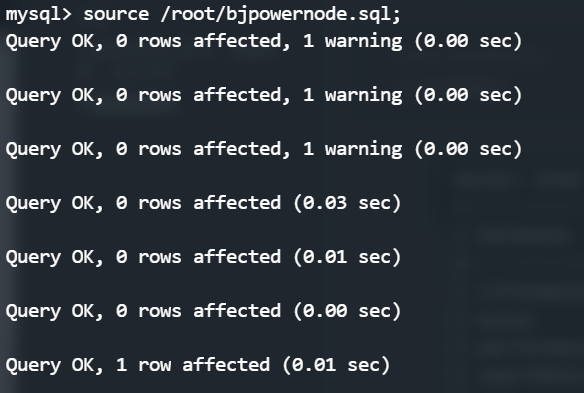

# mysql

## 一 数据准备和常用sql

### 1.SQL DB DBMS分别是什么？有什么关系？ 

>- DB: DataBase(数据库，数据库实际上在硬盘上以文件的形式存在)
>- DBMS: DataBase Management System(数据库管理系统,常见mysql Oracle DB2 sqlServer...)
>- SQL: 结构化查询语言，标准通用语言。sql语言在执行的时候,实际上内部会先编译，然乎在执行sql(sql的编译由DBMS完成)

>DBMS负责执行sql语句,通过sql语句操作DB的数据
>
>DBMS->(执行)->sql->(操作)->DB

### 2.mysql安装

>略

### 3.表

>- teble 是数据库的基本组成单元,所有数据都以变革的形式组织,能增强可读性
>- 包含行和列数据/记录(data) ///字段(column)

```sql
学号	  姓名  年龄
110	   	张三	10
111		李四	11
每个字段应该包含属性
字段名 数据类型 相关的约束
```

### 4.通用的SQL语句，增删改查，sql分类？

>- DQL(数据查询) 查询语句 select 语句
>- DML(数据操作) insert delete update 对表中数据进行增删改
>- DDL(数据定义) create drop alter 对表结构进行增删改
>- TCL (事务控制语言) commit rollback 提交事务 回滚事务
>- DCL(数据控制语言) grant授权 revoke 撤销权限

### 5.数据库加载数据流程

```sql
mysql -uroot -ppassword
```

>

```sql
show databases;
//查看数据库
```

>

```sql
CREATE DATABASE <dataBaseName>
use <databaseName>
```

>
>
>

```sql
source /path/*.sql
```

>

```sql
show tables;
//查看数据库表格
```

>

### 6 删除数据库

```sql
rm -rf ./ **了不得的命令,执行前三思**
drop database <databaseName>
```

### 7 表结构

```sql
desc <tableName>
```

>
>
>
>
>

### 8 表格中数据

>

### 9 常用命令

>- select version();
>- select database();
>
>

## 二  查询

### 1 提示

>- 任何一条sql必须以 ；结尾
>- sql语句不区分大小写
>- 字符串使用单引号
>- 数据库中null不是一个值 代表什么也没有，为空。不能用等号衡量，必须使用 is null Or is not null

### 2 简单查询

```sql
select 字段1 字段2 字段3 ... from 表名;
```

#### 例子

```sql
mysql> select empno,ename from EMP;
+-------+--------+
| empno | ename  |
+-------+--------+
|  7369 | SMITH  |
|  7499 | ALLEN  |
|  7521 | WARD   |
|  7566 | JONES  |
|  7654 | MARTIN |
|  7698 | BLAKE  |
|  7782 | CLARK  |
|  7788 | SCOTT  |
|  7839 | KING   |
|  7844 | TURNER |
|  7876 | ADAMS  |
|  7900 | JAMES  |
|  7902 | FORD   |
|  7934 | MILLER |
+-------+--------+
14 rows in set (0.00 sec)
```

```\
mysql> select ename,sal * 12 from EMP;
+--------+----------+
| ename  | sal * 12 |
+--------+----------+
| SMITH  |  9600.00 |
| ALLEN  | 19200.00 |
| WARD   | 15000.00 |
| JONES  | 35700.00 |
| MARTIN | 15000.00 |
| BLAKE  | 34200.00 |
| CLARK  | 29400.00 |
| SCOTT  | 36000.00 |
| KING   | 60000.00 |
| TURNER | 18000.00 |
| ADAMS  | 13200.00 |
| JAMES  | 11400.00 |
| FORD   | 36000.00 |
| MILLER | 15600.00 |
+--------+----------+
14 rows in set (0.00 sec)
//字段可以参与运算
```

#### as用法

```sql
mysql> select ename,sal * 12 as yearSal from EMP;
+--------+----------+
| ename  | yearSal  |
+--------+----------+
| SMITH  |  9600.00 |
| ALLEN  | 19200.00 |
| WARD   | 15000.00 |
| JONES  | 35700.00 |
| MARTIN | 15000.00 |
| BLAKE  | 34200.00 |
| CLARK  | 29400.00 |
| SCOTT  | 36000.00 |
| KING   | 60000.00 |
| TURNER | 18000.00 |
| ADAMS  | 13200.00 |
| JAMES  | 11400.00 |
| FORD   | 36000.00 |
| MILLER | 15600.00 |
+--------+----------+
14 rows in set (0.00 sec)
//as 给字段名取别名 可以省略as 结果会新增一列
//中文字符串可以用''或者""
//mysql中推荐使用'',可以在别的数据库中使用
```

### 3 条件查询

```sql
select 字段... from ... where ...
```

>先from 然后where 最后select

#### 例子

```sql
查询工资等于5000的员工姓名
mysql> select ename from EMP where sal = 5000;
+-------+
| ename |
+-------+
| KING  |
+-------+
1 row in set (0.00 sec)
```

```sql
查询SMITH的工资
mysql> select sal from EMP where ename = 'SMITH';
+--------+
| sal    |
+--------+
| 800.00 |
+--------+
1 row in set (0.00 sec)
```

#### between ... and ...

```sql
找出工资高于3000的员工
mysql> select ename,sal from EMP where sal > 3000;
+-------+---------+
| ename | sal     |
+-------+---------+
| KING  | 5000.00 |
+-------+---------+
1 row in set (0.00 sec)

//sal >= 3000
//sal < 3000
//sal <= 3000


找出工资不等于3000的人
mysql> select ename,sal from EMP where sal <> 3000;
mysql> select ename,sal from EMP where sal != 3000;
+--------+---------+
| ename  | sal     |
+--------+---------+
| SMITH  |  800.00 |
| ALLEN  | 1600.00 |
| WARD   | 1250.00 |
| JONES  | 2975.00 |
| MARTIN | 1250.00 |
| BLAKE  | 2850.00 |
| CLARK  | 2450.00 |
| KING   | 5000.00 |
| TURNER | 1500.00 |
| ADAMS  | 1100.00 |
| JAMES  |  950.00 |
| MILLER | 1300.00 |
+--------+---------+
12 rows in set (0.00 sec)

//找出工资在1100和3000之间的员工包含1100和3000
mysql> select ename,sal from EMP where sal >= 1100 and sal <= 3000;
mysql> select ename,sal from EMP where sal between 1100 and 3000;
+--------+---------+
| ename  | sal     |
+--------+---------+
| ALLEN  | 1600.00 |
| WARD   | 1250.00 |
| JONES  | 2975.00 |
| MARTIN | 1250.00 |
| BLAKE  | 2850.00 |
| CLARK  | 2450.00 |
| SCOTT  | 3000.00 |
| TURNER | 1500.00 |
| ADAMS  | 1100.00 |
| FORD   | 3000.00 |
| MILLER | 1300.00 |
+--------+---------+
11 rows in set (0.00 sec)
//between ... and...
//还可以使用在字符方面
//select ename from emp where ename between 'A' and 'B';
```

#### is null or is not null 

```sql
mysql> select ename,sal,comm from EMP where comm is not null;
+--------+---------+---------+
| ename  | sal     | comm    |
+--------+---------+---------+
| ALLEN  | 1600.00 |  300.00 |
| WARD   | 1250.00 |  500.00 |
| MARTIN | 1250.00 | 1400.00 |
| TURNER | 1500.00 |    0.00 |
+--------+---------+---------+
4 rows in set (0.00 sec)
//
//0 和null 不一样

//那些人没有津贴
mysql> select ename,sal,comm from EMP where comm is null or comm = 0;
+--------+---------+------+
| ename  | sal     | comm |
+--------+---------+------+
| SMITH  |  800.00 | NULL |
| JONES  | 2975.00 | NULL |
| BLAKE  | 2850.00 | NULL |
| CLARK  | 2450.00 | NULL |
| SCOTT  | 3000.00 | NULL |
| KING   | 5000.00 | NULL |
| TURNER | 1500.00 | 0.00 |
| ADAMS  | 1100.00 | NULL |
| JAMES  |  950.00 | NULL |
| FORD   | 3000.00 | NULL |
| MILLER | 1300.00 | NULL |
+--------+---------+------+
11 rows in set (0.00 sec)
```

#### and 和 or 优先级

```sql
//岗位为MANAGER 和SALESMAN的员工
mysql> select ename,job from EMP where job = 'MANAGER' or job = 'SALESMAN';
+--------+----------+
| ename  | job      |
+--------+----------+
| ALLEN  | SALESMAN |
| WARD   | SALESMAN |
| JONES  | MANAGER  |
| MARTIN | SALESMAN |
| BLAKE  | MANAGER  |
| CLARK  | MANAGER  |
| TURNER | SALESMAN |
+--------+----------+
7 rows in set (0.00 sec)

//and和or联合使用，薪资大于1000的并且部门编号是20或者30部门的员工
//and 和 or 遇到一起 and 优先级高
mysql> select ename,sal,deptno from EMP where sal > 1000 and (deptno = 20 or deptno = 30);
+--------+---------+--------+
| ALLEN  | 1600.00 |     30 |
| WARD   | 1250.00 |     30 |
| JONES  | 2975.00 |     20 |
| MARTIN | 1250.00 |     30 |
| BLAKE  | 2850.00 |     30 |
| SCOTT  | 3000.00 |     20 |
| TURNER | 1500.00 |     30 |
| ADAMS  | 1100.00 |     20 |
| FORD   | 3000.00 |     20 |
+--------+---------+--------+
9 rows in set (0.00 sec)
```

#### in 和 not in

```sql
mysql> select ename,job from EMP where job in ('SALESMAN','MANAGER');
+--------+----------+
| ename  | job      |
+--------+----------+
| ALLEN  | SALESMAN |
| WARD   | SALESMAN |
| JONES  | MANAGER  |
| MARTIN | SALESMAN |
| BLAKE  | MANAGER  |
| CLARK  | MANAGER  |
| TURNER | SALESMAN |
+--------+----------+
7 rows in set (0.00 sec)

mysql> select ename,job from EMP where sal in (1000,5000);
+-------+-----------+
| ename | job       |
+-------+-----------+
| KING  | PRESIDENT |
+-------+-----------+
1 row in set (0.00 sec)

mysql> select ename,job,sal from EMP where sal in (1000,5000);
+-------+-----------+---------+
| ename | job       | sal     |
+-------+-----------+---------+
| KING  | PRESIDENT | 5000.00 |
+-------+-----------+---------+
1 row in set (0.00 sec)
//in后面的不是区间,是具体的值
//not in 不在这几个值中
mysql> select ename,job,sal from EMP where sal not in (1000,5000);
+--------+----------+---------+
| ename  | job      | sal     |
+--------+----------+---------+
| SMITH  | CLERK    |  800.00 |
| ALLEN  | SALESMAN | 1600.00 |
| WARD   | SALESMAN | 1250.00 |
| JONES  | MANAGER  | 2975.00 |
| MARTIN | SALESMAN | 1250.00 |
| BLAKE  | MANAGER  | 2850.00 |
| CLARK  | MANAGER  | 2450.00 |
| SCOTT  | ANALYST  | 3000.00 |
| TURNER | SALESMAN | 1500.00 |
| ADAMS  | CLERK    | 1100.00 |
| JAMES  | CLERK    |  950.00 |
| FORD   | ANALYST  | 3000.00 |
| MILLER | CLERK    | 1300.00 |
+--------+----------+---------+
13 rows in set (0.01 sec)
```

#### 模糊查询like

>- % 任意多个字符 
>- _  任意一个字符
>- 转义字符  \。\_ 表示下划线

```sql
//找出名字中含有o的
mysql> select ename from EMP where ename like '%o%';
+-------+
| ename |
+-------+
| JONES |
| SCOTT |
| FORD  |
+-------+
3 rows in set (0.00 sec)

//找出名字中第二个字母是A的
mysql> select ename from EMP where ename like '_A%';
+--------+
| ename  |
+--------+
| WARD   |
| MARTIN |
| JAMES  |
+--------+
3 rows in set (0.00 sec)

//名字中含有下划线的
mysql> select ename from EMP where ename like '%\_%';
Empty set (0.00 sec)

//名字中最后一个字符是T的
mysql> select ename from EMP where ename like '%T';
+-------+
| ename |
+-------+
| SCOTT |
+-------+
1 row in set (0.00 sec)
```

### 三 数据处理

#### 1 排序

>- 默认升序排列 ORDER BY <字段>
>- asc 表示升序 desc 表示降序
>- 多字段同时排序，越靠前的字段权重越大，后面字段，可能都没有权重，前边字段无法完成排序时，后边字段才会哟作用

按照工资升序或者降序排序

```sql
mysql> select ename,sal from EMP order by sal asc;
mysql> select ename,sal from EMP order by sal desc;

//工资降序排列 工资相同时按照名字的升序排列
mysql> select ename,sal from EMP order by sal desc,ename asc;

//2列不推荐表格顺序变化，sql不再能使用
mysql> select ename,sal from EMP order by 2;

//找出岗位是SALESMAN的员工，按照薪资降序排列
mysql> select ename,sal from EMP where job = 'SALESMAN' order by sal desc;
+--------+---------+
| ename  | sal     |
+--------+---------+
| ALLEN  | 1600.00 |
| TURNER | 1500.00 |
| WARD   | 1250.00 |
| MARTIN | 1250.00 |
+--------+---------+
4 rows in set (0.00 sec)
```


